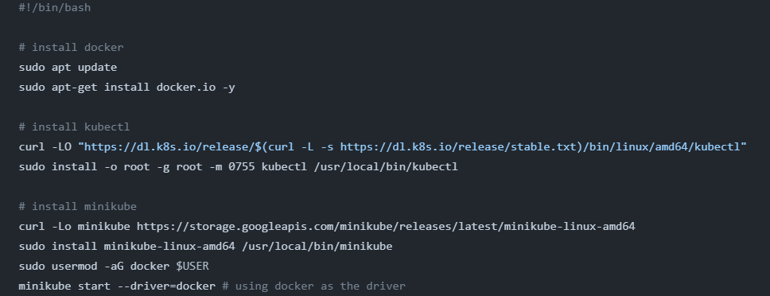

# CI/CD pipeline with GitHub Actions
The Objective is to explain a step-by-step guide on how to set up a CI/CD pipeline with GitHub Actions to deploy any application of your choice (in this case a python FastAPI) from GitHub to a Minikube cluster, that running on an EC2 instance deployed using Terraform. You can picture the flow this way:
`GitHub` -> `AWS EC2` -> `Minikube`

#### Step 1: Prepared the Code Repository
- Create a new [repository](https://github.com/olugbedu/CI-CD-pipeline-with-GitHub-Actions) on GitHub.
- Add your [application](./main.py) code to the repository. 
- Step up the environments and dependencies for your application
- Add your [Dockerfile](./Dockerfile) for the application, to containerize it.

#### Step 2: Set Up GitHub Actions
In the repository, create a `YAML file` [deploy.yml](https://github.com/olugbedu/CI-CD-pipeline-with-GitHub-Actions/blob/main/.github/workflows/deploy.yml) inside a `.github/workflows` directory with the required configurations to build, tag and push the docker image to docker hub.
- 

```yml
build-image:
    runs-on: ubuntu-latest

    steps:
    - name: Checkout Code
      uses: actions/checkout@v4

    - name: Set up Docker Buildx
      uses: docker/setup-buildx-action@v2

    - name: Log in to DockerHub
      uses: docker/login-action@v2
      with:
        username: ${{ secrets.DOCKER_USERNAME }}
        password: ${{ secrets.DOCKER_PASSWORD }}

    - name: Build and Push Docker Image
      run: |
        docker build -t ${{ secrets.DOCKER_USERNAME }}/adedeji-portfolio:latest .
        docker push ${{ secrets.DOCKER_USERNAME }}/adedeji-portfolio:latest
```


#### Step 3: Set Up Terraform for EC2 and Minikube

Click [here](https://registry.terraform.io/providers/hashicorp/aws/latest/docs) to know more about how to write terraform modules
In your code editor (VS code)
- Create terraform [modules](./modules/) for your [EC2](./modules/ec2/) and [VPC](./modules/vpc/)
- Write a shell [script](./modules/ec2/scripts/install_minikube.sh) to `configure kubectl` and `install minikube` in the EC2 instance
  
- Create [root modules](main.tf)
- Ensure to create of attach a `keypair` in your modules
- Include `Public_ip` in the `output` of the `root` module
- Run the `terraform plan` and `terraform apply` commands.
 

#### Step 4: Access the Minikube Cluster
To `SSH` into the created EC2 instance using the `public IP` output from Terraform.
- log into your aws console,  search for "ec2" in the search field
- Click on the ec2 and instances, you will find your new instance

- Click on connect, select ssh client


- Navigate to your ssh private key folder on your local computer
- Copy and paste the ssh address from the ec2 instance to connect.


#### Step 5: Write the Kubernetes Manifests
Click [here](https://kubernetes.io/docs/concepts/workloads/controllers/deployment/) to know more about kubernetes manifests
- [deployment.yaml](./k8S/deployment.yaml) 
```yaml
apiVersion: apps/v1
kind: Deployment
metadata:
  name: adedeji-portfolio
spec:
  replicas: 2
  selector:
    matchLabels:
      app: adedeji-portfolio
  template:
    metadata:
      labels:
        app: adedeji-portfolio
    spec:
      containers:
      - name: adedeji-portfolio
        image: gbedu/adedeji-portfolio:latest
        imagePullPolicy: Always
        ports:
        - containerPort: 80
        resources:
            requests:
                memory: "128Mi"
                cpu: "250m"
            limits:
                memory: "256Mi"
                cpu: "500m"
```

- [service.yaml](./k8S/service.yaml)
```yaml
apiVersion: v1
kind: Service
metadata:
  name: adedeji-portfolio
spec:
  type: ClusterIP
  selector:
    app: adedeji-portfolio
  ports:
  - protocol: TCP
    port: 80
    targetPort: 8000
```


#### Step 6: Automate Deployment with GitHub Actions
Update the GitHub Actions [workflow](https://github.com/olugbedu/CI-CD-pipeline-with-GitHub-Actions/blob/main/.github/workflows/deploy.yml)
- Deploy to the Minikube cluster on the EC2 instance. 
- Ensure the SSH keys are securely managed.
  - Go to the repository `settings`
  - Click on `secrets and variables` -> `Actions` -> `new repository secret`
  - There, you can create your secrets as key-value pairs as shown in the image below
  
  

```yml
Deploy:
    runs-on: ubuntu-latest

    steps:
    - name: SSH into EC2
      uses: appleboy/ssh-action@master
      with:
        host: ${{ secrets.EC2_PUBLIC_IP }}
        username: ubuntu
        key: ${{ secrets.EC2_SSH_KEY }}

    - name: Deploy to Minikube
      run: |
        minikube start
        kubectl config use-context minikube
        kubectl apply -f k8S/deployment.yaml 
        kubectl apply -f k8S/service.yaml 
      shell: bash
      continue-on-error: true

    - name: Verify Deployment
      run: |
        kubectl get deployment
        kubectl get svc
      shell: bash
      continue-on-error: true
```


