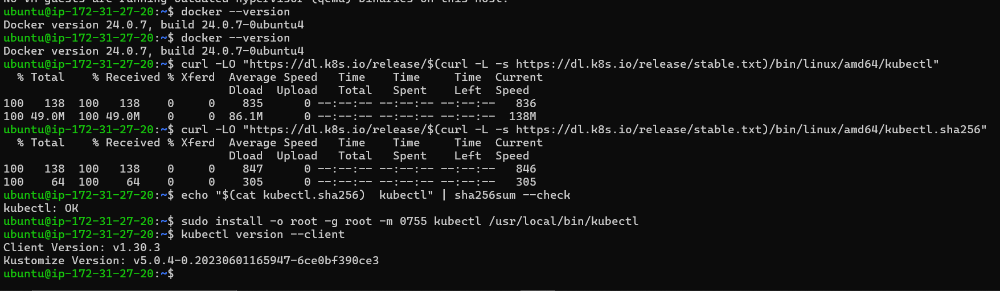
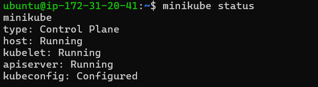
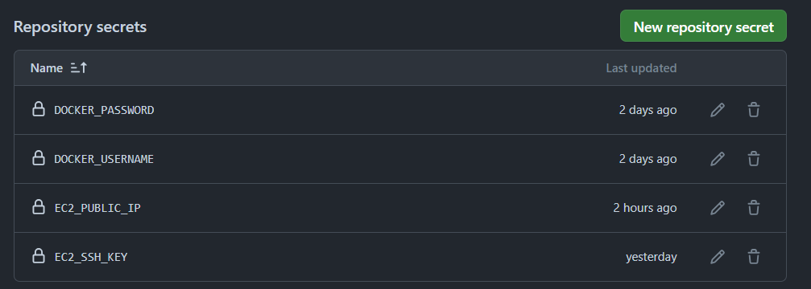
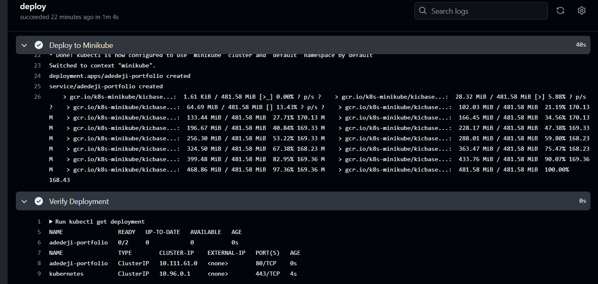

# Deliverables

## 1. Documentations of your processes

#### Step 1: Prepared the Code Repository
- Created a new [repository](https://github.com/olugbedu/CI-CD-pipeline-with-GitHub-Actions) on GitHub and pushed application code.
- Added [application](./main.py) code to the repository. 
- Added a [Dockerfile](./Dockerfile) for the application, to containerize it
- Pushed image to Docker image registry using GitHub Actions
```yml
- name: Set up Docker Buildx
      uses: docker/setup-buildx-action@v2

    - name: Log in to DockerHub
      uses: docker/login-action@v2
      with:
        username: ${{ secrets.DOCKER_USERNAME }}        # provided in the repository secret
        password: ${{ secrets.DOCKER_PASSWORD }}        # provided in the repository secret

    - name: Build and Push Docker Image
      run: |
        docker build -t ${{ secrets.DOCKER_USERNAME }}/adedeji-portfolio:latest .
        docker push ${{ secrets.DOCKER_USERNAME }}/adedeji-portfolio:latest
```


#### Step 2: Set Up GitHub Actions
- In the repository, I created a YAML file deploy.yml inside a .github/workflows directory with the required configurations [here](https://github.com/olugbedu/CI-CD-pipeline-with-GitHub-Actions/blob/main/.github/workflows/deploy.yml)

#### Step 3: Set Up Terraform for EC2 and Minikube
- Created terraform [modules](./modules/) for your [EC2](./modules/ec2/), [VPC](./modules/vpc/)
- Created [root modules](main.tf)
- Created an EC2 instance with [Minikube](./modules/ec2/scripts/install_minikube.sh) running on it.
- Run the appropriate Terraform commands in your terminal. 

#### Step 4: Access the Minikube Cluster
- SSH into the created EC2 instance using the public IP output from Terraform. Inside the EC2 instance, I installed docker as the driver, changed my user mode for docker with the command `sudo usermod -aG docker $USER`, configured kubectl to use the Minikube cluster. Then I cloned my git repo into the instance, and applied the k8s manifests and ensured it runs perfectly. Here are screenshots of the steps and commands.
`sudo apt update`
    
`sudo apt-get install docker.io -y`
    
    
   ` minikube start`
    
    
    
    
    

#### Step 5: Automate Deployment with GitHub Actions
- Update the GitHub Actions [workflow](https://github.com/olugbedu/CI-CD-pipeline-with-GitHub-Actions/blob/main/.github/workflows/deploy.yml) to deploy to the Minikube cluster on the EC2 instance. Ensure the Minikube instance's IP and SSH keys are securely managed. 


## 2. Screenshots of your results from each step
GitHub Action





## 3. Application for Deployment
I used Python FastAPI
```python
from fastapi import FastAPI

app = FastAPI()

@app.get("/")
def read_root():
    return {"message": "Welcome to Adedeji's Portfolio"}

@app.get("/about")
def read_about():
    return {"about": "This is Adedeji's portfolio application."}
```

## 4. Docker image


## 5. Terraform Modules 
- I created EC2 module [here](./modules/ec2/)
- I created VPC module [here](./modules/vpc/)
- I created Root module [here](main.tf)

## 6. Kubernetes Manifests
- [deployment.yaml](./k8S/deployment.yaml) 
```yaml
apiVersion: apps/v1
kind: Deployment
metadata:
  name: adedeji-portfolio
spec:
  replicas: 2
  selector:
    matchLabels:
      app: adedeji-portfolio
  template:
    metadata:
      labels:
        app: adedeji-portfolio
    spec:
      containers:
      - name: adedeji-portfolio
        image: gbedu/adedeji-portfolio:latest
        imagePullPolicy: Always
        ports:
        - containerPort: 80
        resources:
            requests:
                memory: "128Mi"
                cpu: "250m"
            limits:
                memory: "256Mi"
                cpu: "500m"
```

- [service.yaml](./k8S/service.yaml)
```yaml
apiVersion: v1
kind: Service
metadata:
  name: adedeji-portfolio
spec:
  type: ClusterIP
  selector:
    app: adedeji-portfolio
  ports:
  - protocol: TCP
    port: 80
    targetPort: 8000
```


